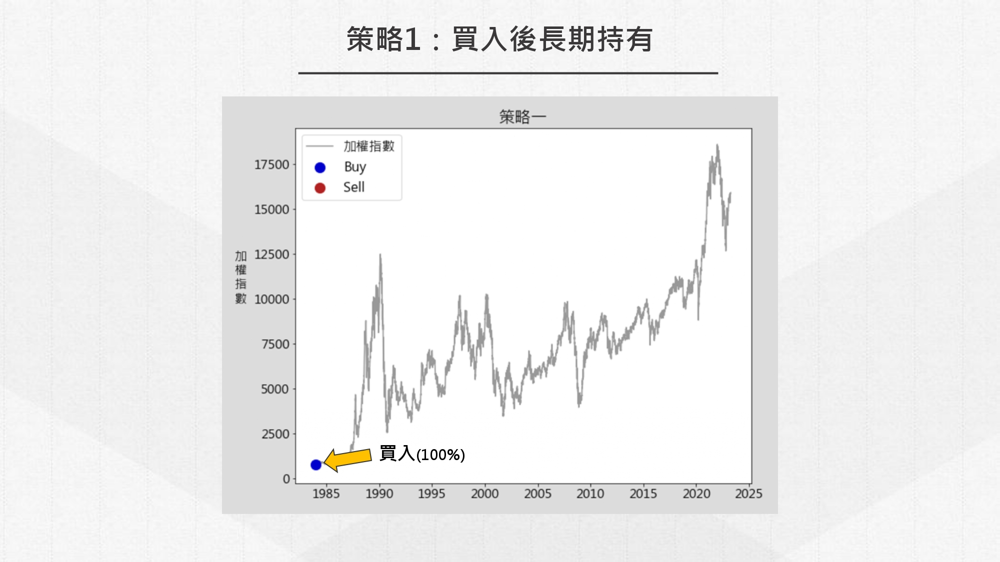
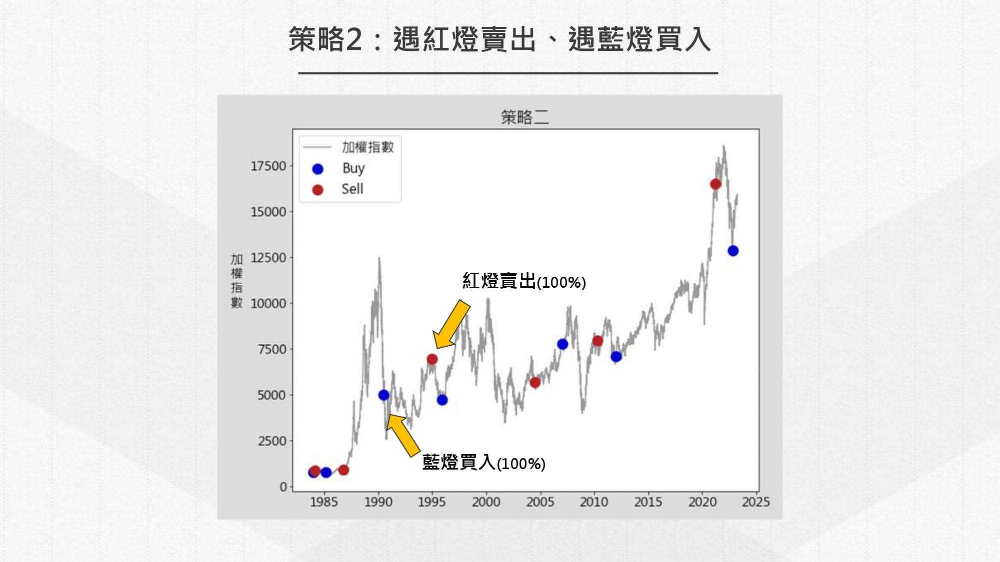
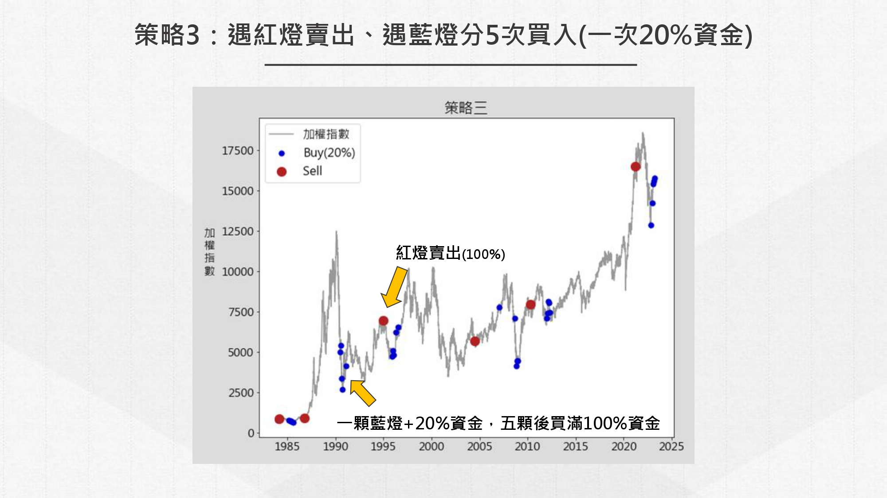
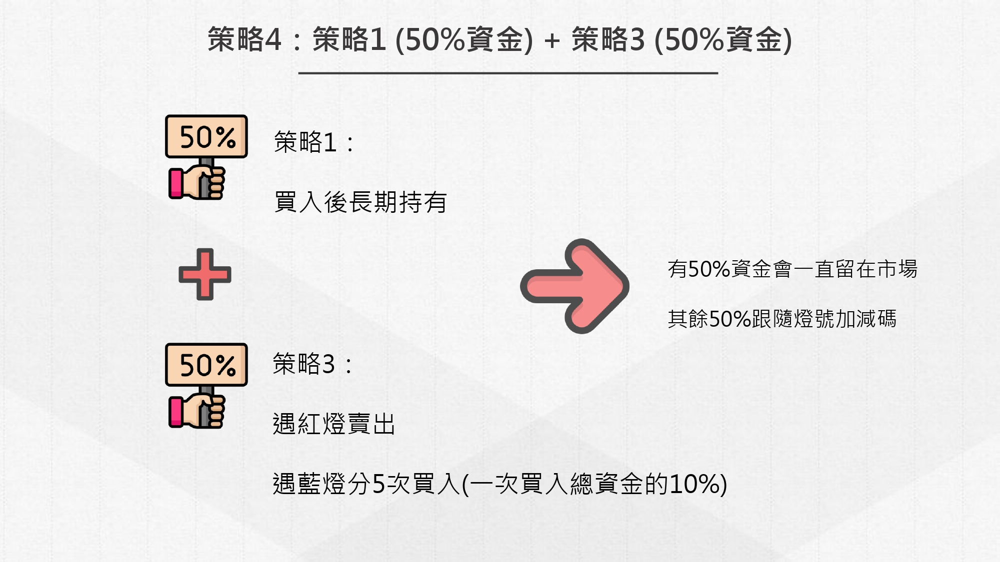
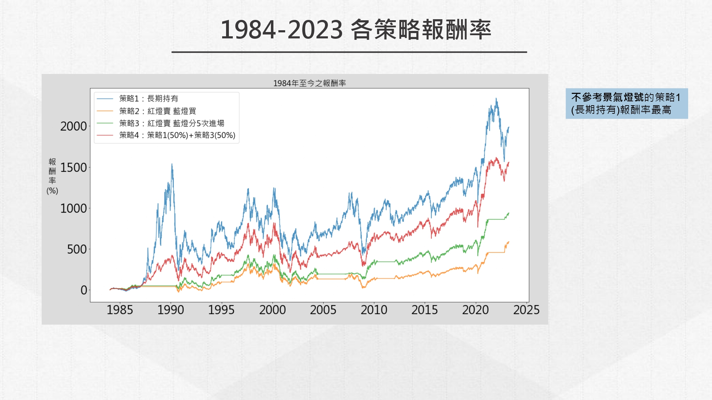
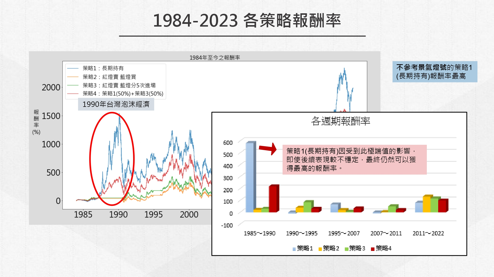
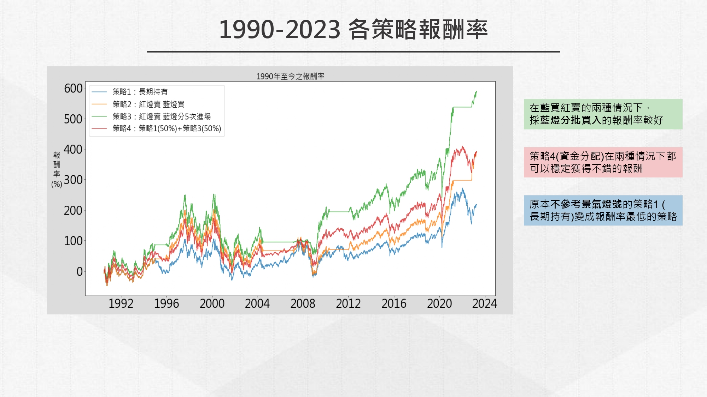

# 景氣對策信號與指數投資之相關性

### 研究目的：
1.景氣燈號對於指數投資者是否有參考性？  
2.可以以什麼方式使用？

### 研究方法：
- 以不同的景氣燈號使用方式，制定四種策略，進而比較各策略的報酬率走勢
- 策略交易時間設定為公布日後的下一個開盤日
> [點此](main.py)查看程式碼

## 策略示意圖：

## 報酬率走勢及觀察結果：

#### [查看完整簡報](Report.pdf)
### 資料來源：
- TEJ台灣經濟新報資料庫
- 指數：[index.csv](index.csv)
- 景氣對策信號：[signal.csv](signal.csv)
