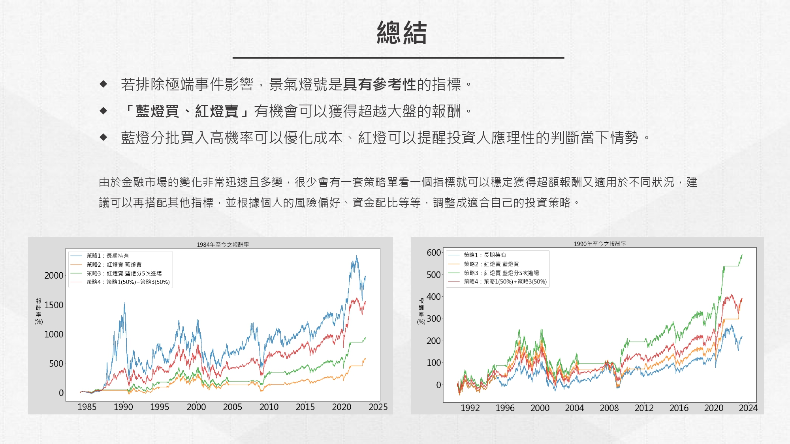

<<<<<<< HEAD
# 景氣對策信號與指數投資之相關性

### 研究目的：
1.景氣燈號是否有參考性？
2.可以怎麼使用？

### 研究方法：
- 制定以下四種策略，比較
- 交易時間：於公布日隔天開盤時進行交易
- 
=======
# 景氣對策信號與指數投資之相關性

### 研究目的：
1.景氣燈號對於是否有參考性？  
2.可以怎麼使用？

### 研究方法：
- 制定使用不同方式的策略，比較各策略的報酬率走勢
- 交易時間為公布日後的下一個開盤日

### 策略示意圖：

### 報酬率走勢及觀察結果：

>>>>>>> b2b7f0f66803198b60c0481bc3ec92227201ea8c
